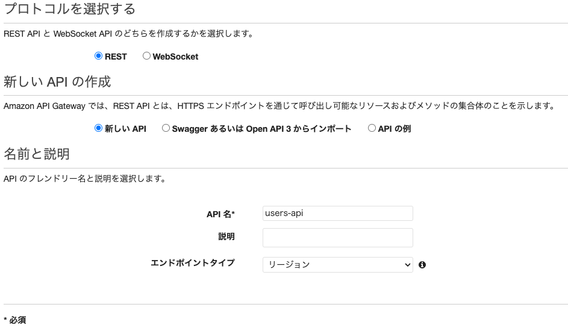
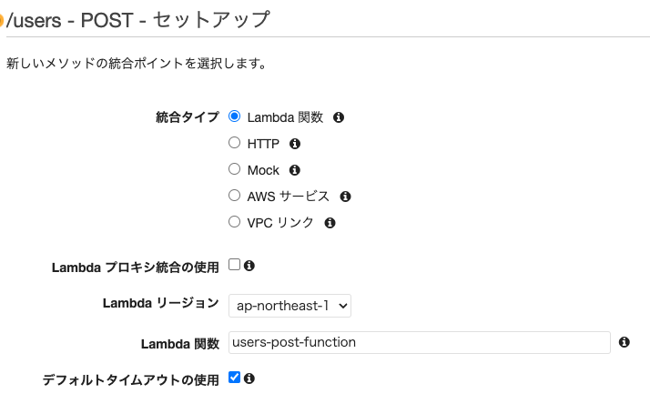
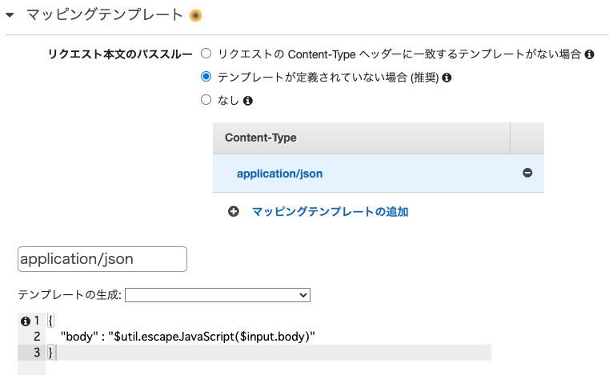
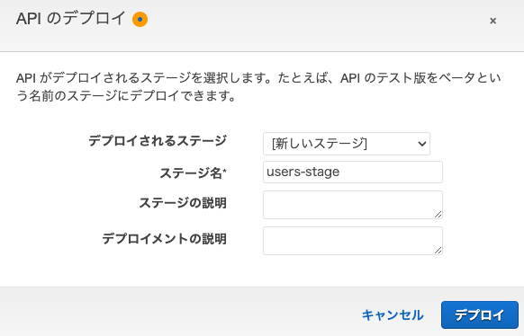

# REST-APIをAWSで実装する

- [講座情報](https://www.udemy.com/course/awsrest-api/learn/lecture/33857942#overview)

## 作業記録

1. Poetryの導入
2. 講座を開始

### Poetryの導入実験

- [参考ドキュメント:Poetry documentation 日本語](https://cocoatomo.github.io/poetry-ja/)

1. インストール
    - 公式ドキュメントのコマンドでは404エラーが発生してインストール出来ない

    ``` bash
    curl -sSL https://install.python-poetry.org | python -
    ```

2. プロジェクトのセットアップ
    - Poetryの管理に関わるファイル
        - `pyproject.toml` : 最も重要なファイル。プロジェクトの依存関係を統括する
        - `poetry.lock` : 依存関係のパッケージのバージョンを指定する
    - プロジェクトの作成コマンド

    ``` bash
    # 新規にプロジェクトを作る場合
    > poetry new poetry-demo

    # すでに存在するプロジェクトでPoetryを有効にする場合
    > poetry init
    ```

    - 依存関係の定義・インストールコマンド
        - インストールするパッケージのバージョンを固定したい場合は `poetry.lock` で定義する

    ``` bash
    # 依存するパッケージの追加・インストール
    > poetry add ${パッケージ名}

    # パッケージを削除する
    > poetry remove ${パッケージ名}

    # プロジェクトで定義された依存するパッケージのインストール
    > poetry install

    # プロジェクトで定義された依存するパッケージのバージョンアップ
    > poetry update

    # 利用可能なパッケージを列挙する
    > poetry show
    ```

    - スクリプトの実行コマンド

    ``` bash
    # 作成したPythonスクリプトの実行
    > poetry run python ${スクリプト名}
    ```

    - 仮想環境の起動コマンド

    ``` bash
    # 仮想環境を起動する
    > poetry shell

    # 仮想環境を終了する
    > exit

    # シェルを無くさずに仮想環境を終了する
    > deactivate
    ```

### 受講メモ

#### 使用環境

|ツール|Version|メモ|
|---|---|---|
|OS: Mac|13.4（22F66）||
|curl|8.1.2||

#### ゴール

- REST APIの特徴（メリット、デメリット）を説明できる
    - メリット
    - デメリット
- サーバレスアーキテクチャの特徴（メリット、デメリット）を説明できる
- AWSの以下のサービスを使った講座の環境を説明できる
    - Amazon API Gateway
    - AWS Lambda
    - Amazon DynamoDB

#### APIの種類

- API
    - API: 単一のAPIリクエストを1回のAPI呼び出しで行うAPI
    - Composite API: 複数のAPIリクエストを1回のAPI呼び出しで可能にするAPI
- APIの公開範囲
    - Open API: 全ての企業などに公開しているAPI
        - 例: Google Maps API
    - Partner API: 特定の企業、個人に限定公開しているAPI
        - 例: Amazon Product Advertising API
    - Closed API: 非公開のAPI -> 外部の人は使えない
        - 例: A銀行預金残高API
- APIの作り方
    - REST API: リソース単位(各リソースで実行できる処理を作る)で作成する。 XML、JSON形式で提供される
    - SOAP: メソッド単位(登録などの操作単位で各リソースにアクセスする)で作成する。 XML形式で提供される

#### REST API

- 定義
    - 簡易なXML、JSON形式のリクエスト・レスポンスを採用
    - HTTPプロトコルを採用
    - RESTの原則に準拠している
        - ステートレスなクライアント/サーバープロトコルを採用している
            - サーバーの処理をシンプルにすることができる
                - サーバー資源を節約できる
            - スケーラビリティおあるシステムになる
                - 状態を記憶する必要が無いのでサーバーを単純に増やすことでスループットを上げることができる
        - すべてのリソースに適用できる「よく定義さらたメソッド」のセットであること
            - POST/GET/PUT/PATCH/DELETEなどで操作する
        - スロースを一意に識別する「汎用的な構文」を使用していること
            - 基本的な構文はツールが変わっても同じである
        - アプリケーションの情報と状態遷移の療法を扱うことができる「ハイパーメディア」を使用していること

- メリット
    - サーバ資源の有効活用
    - スケーラビリティのあるシステムになる
    - APIの開発者のスキル習得がし易い

- デメリット
    - 情報を多く送る必要があるとトラフィックを圧迫してしまい、レスポンスが遅くなる
    - リクエスト、レスポンスの中身は統一されていないので使用者はToolによって内容を確認する必要がある
    - 使う側の習得コストは少し高い
        - 基本構文が決まっているのでToolごとにマニュアルをチェックすれば使い方のイメージはし易いと自分は感じている

#### サーバレス環境

- サーバを常設するよりも、安く気軽に使いやすい
    - カスタマイズの自由度は少ないが自分たちで調整する部分も少ないため管理が用意

- 環境の比較

||オンプレミス|Iaas|サーバーレス|
|----|----|----|----|
|物理インフラ構築要否|要|不要(OSやCPUメモリ容量の設定は必要)|不要|
|費用|構築するシステムに応じた一括課金|サーバ稼働に応じた重量課金|プログラム実行に応じた従量課金|
|運用管理範囲(プログラム)|◯|◯|◯|
|運用管理範囲(ミドルウェア)|◯|◯|ー|
|運用管理範囲(OS)|◯|ー|
|運用管理範囲(ハードウェア)|◯|ー|ー|
|リソース(CPU,メモリ等)調整可能|否(費用面で難しい)|可(半自動)|可(自動調整可)|

- `FaaS` とも呼ばれる

- メリット
    - 費用がプログラムの実行分(リクエスト数分)だけで住む

- デメリット
    - サーバが常時起動しているわけではないため、即応性が低い(レスポンスが遅くなる)

- 適したシステム
    - 実行頻度の少ないシステム
- 適さないシステム
    - 実行頻度が多いシステム
    - サーバを常時起動しておきたいようなシステム

#### ハンズオン

##### 使用するサービス

以下の5つのサービスを使用する。(太字は特に理解したい)

- **Amazon API Gateway**: HTTPリクエストを各APIにルーティングするために使用する
- **AWS Lambda**: APIの処理を実装する
- Amazon DynamoDB: DBのテーブルとして使用する。RDBのような前準備がなくても動かせる
- AWS IAM: LambdaからDBへのアクセス権限を付与するために使用する
- **Amazon Cloud Watch**: Lambda関数のログを確認するために使用する

##### ハンズオンの流れ

1. DB作成
1. IAMロール作成
1. Lambda関数の作成
    1. リソース作成
    1. POSTメソッド
    1. GETメソッド
    1. PUTメソッド
    1. DELETEメソッド
1. REST APIの動作確認
    1. POSTメソッド
    1. GETメソッド
    1. PUTメソッド
    1. DELETEメソッド

##### ハンズオンの作業記録

- 作成した成果物のリンク
    - [DynamoDB: users](https://ap-northeast-1.console.aws.amazon.com/dynamodbv2/home?region=ap-northeast-1#table?name=users)【削除済み】
    - [IAM Role: users-role](https://us-east-1.console.aws.amazon.com/iamv2/home?region=ap-northeast-1#/roles/details/users-role?section=permissions)【削除済み】
    - [Lambda: users-post-function](https://ap-northeast-1.console.aws.amazon.com/lambda/home?region=ap-northeast-1#/functions/users-post-function?newFunction=true&tab=code)【削除済み】
    - [Lambda: users-get-function](https://ap-northeast-1.console.aws.amazon.com/lambda/home?region=ap-northeast-1#/functions/users-get-function?newFunction=true&tab=code)【削除済み】
    - [Lambda: users-put-function](https://ap-northeast-1.console.aws.amazon.com/lambda/home?region=ap-northeast-1#/functions/users-put-function?newFunction=true&tab=code)【削除済み】
    - [Lambda: users-delete-function](https://ap-northeast-1.console.aws.amazon.com/lambda/home?region=ap-northeast-1#/functions/users-delete-function?newFunction=true&tab=code)【削除済み】
    - [API Gateway: users-api](https://ap-northeast-1.console.aws.amazon.com/apigateway/home?region=ap-northeast-1#/apis/qq5227vy5m/resources/f6oy70a98g) 【削除済み】
    - [API Gateway Stage: users-stage](https://ap-northeast-1.console.aws.amazon.com/apigateway/home?region=ap-northeast-1#/apis/qq5227vy5m/stages/users-stage)【削除済み】
    - CloudWatch: Lambdaの実行ログが勝手に残っている【削除済み】

- IAMのポリシー設定
    - [AWSLambdaBasicExecutionRole](https://us-east-1.console.aws.amazon.com/iamv2/home?region=ap-northeast-1#/policies/details/arn%3Aaws%3Aiam%3A%3Aaws%3Apolicy%2Fservice-role%2FAWSLambdaBasicExecutionRole?section=policy_permissions): Lambda関数からCloud Watchにログを出力できるようにする権限
    - [AmazonDynamoDBFullAccess](https://us-east-1.console.aws.amazon.com/iamv2/home?region=ap-northeast-1#/policies/details/arn%3Aaws%3Aiam%3A%3Aaws%3Apolicy%2FAmazonDynamoDBFullAccess?section=policy_permissions): Lambda関数からAmazon DynamoDBにアクセスする権限

- Lambdaのコード解説
    - `import boto3` はPythonでAWSのリソースを操作するためのライブラリ
    - `lambda_handler(event, context)` の引数
        - `event` にRequestパラメータの値が入っている。`str` 型で渡されるので `JSON` 形式に変更する必要がある。
    - `name` はAWSの予約後になっているため、 `#name` としてカラムネームであることを宣言している
    - 処理のスタートは `lambda_handler()` となる
    - コードを修正したあとに `Deploy` を行うことで作成したコードがAWS環境で使えるようになる

- API Gatewayの設定方法
    - `REST API` を選択する
    - 新しいAPIの作成は `新しいAPI` を選択する
    
    - `users` のリソースを作成する
    - `POST` メソッドの作成
    
    - `統合リクエスト` で `マッピングテンプレート` の定義を行う
    
    - `APIのデプロイ` を行う -> ステージを作る
    

- 動作確認結果

``` bash
# 一人目のデータを登録
❯ curl -X POST -H "Content-Type: application/json" -d "{\"id\":\"001\",\"name\":\"A\",\"age\":\"10\",\"address\":\"Tokyo\",\"tel\":\"090-1111-1111\"}" https://qq5227vy5m.execute-api.ap-northeast-1.amazonaws.com/users-stage/users
null%     
# 二人目のデータを登録
❯ curl -X POST -H "Content-Type: application/json" -d "{\"id\":\"002\",\"name\":\"B\",\"age\":\"20\",\"address\":\"Osaka\",\"tel\":\"090-2222-2222\"}" https://qq5227vy5m.execute-api.ap-northeast-1.amazonaws.com/users-stage/users
null%
# 三人目のデータを登録
❯ curl -X POST -H "Content-Type: application/json" -d "{\"id\":\"003\",\"name\":\"C\",\"age\":\"30\",\"address\":\"Nagoya\",\"tel\":\"090-3333-3333\"}" https://qq5227vy5m.execute-api.ap-northeast-1.amazonaws.com/users-stage/users
null%    

# 一人目のデータを取得する
❯ curl -X GET https://qq5227vy5m.execute-api.ap-northeast-1.amazonaws.com/users-stage/users\?id\=001
{"tel": "090-1111-1111", "address": "Tokyo", "id": "001", "name": "A", "age": "10"}%    
# 全員分のデータを取得する
❯ curl -X GET https://qq5227vy5m.execute-api.ap-northeast-1.amazonaws.com/users-stage/users         
[{"tel": "090-1111-1111", "address": "Tokyo", "id": "001", "name": "A", "age": "10"}, {"tel": "090-3333-3333", "address": "Nagoya", "id": "003", "name": "C", "age": "30"}, {"tel": "090-2222-2222", "address": "Osaka", "id": "002", "name": "B", "age": "20"}]%        

# 一人目のデータを上書きする
❯ curl -X PUT -H "Content-Type: application/json" -d "{\"id\":\"001\",\"name\":\"Z\",\"age\":\"99\",\"address\":\"Okinawa\",\"tel\":\"090-9999-9999\"}" https://qq5227vy5m.execute-api.ap-northeast-1.amazonaws.com/users-stage/users
null%    
# 一人目のデータを取得する
❯ curl -X GET https://qq5227vy5m.execute-api.ap-northeast-1.amazonaws.com/users-stage/users\?id\=001
{"tel": "090-9999-9999", "address": "Okinawa", "id": "001", "name": "Z", "age": "99"}%    

# 一人目のデータを削除する
❯ curl -X DELETE https://qq5227vy5m.execute-api.ap-northeast-1.amazonaws.com/users-stage/users\?id\=001
null%    
# 一人目のデータが削除されたことを確認する
# ミスって全てDELETEしてからは何を送ってもErrorが応答されるようになってしまった

# 全てのデータを削除する
# 本操作でDynamoDBのテーブルの情報も消えてしまう
❯ curl -X DELETE https://qq5227vy5m.execute-api.ap-northeast-1.amazonaws.com/users-stage/users         
null%      
```
